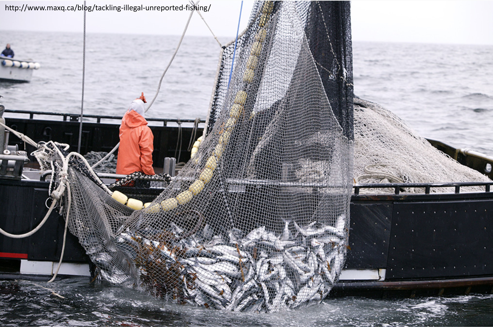

## Conservation genetics/genomics of exploited species

::: {.columns}

::: {.column width="40%"}

Many commercially important species, including some under conservation concern, are still managed with limited knowledge of their basic population genetic structure (biocomplexity). We work with fisheries management agencies (Fisheries and Oceans Canada, Institute of Marine Research in Norway, and the Greenland Institute of Natural Resources), and other partners (e.g., Ocean Tracking Network) to better understand the ecology, life history strategies and evolutionary history of key commercial species and those of special conservation concern. We use genetic/genomic tools to outline population structure, characterise the potential for local adaptation, and understand how both can change in light of climate regime shifts and other environmental alterations. Ongoing projects include white hake (*Urophycis tenuis*) in the Northwest Atlantic, circumpolar distributions of Greenland halibut (*Reinhardtius hippoglossoides*), and we hope to develop projects related to Arctic cod (*Boreogadus saida*) in the Arctic.

:::

::: {.column width="60%"}

{.research-img}

:::

:::